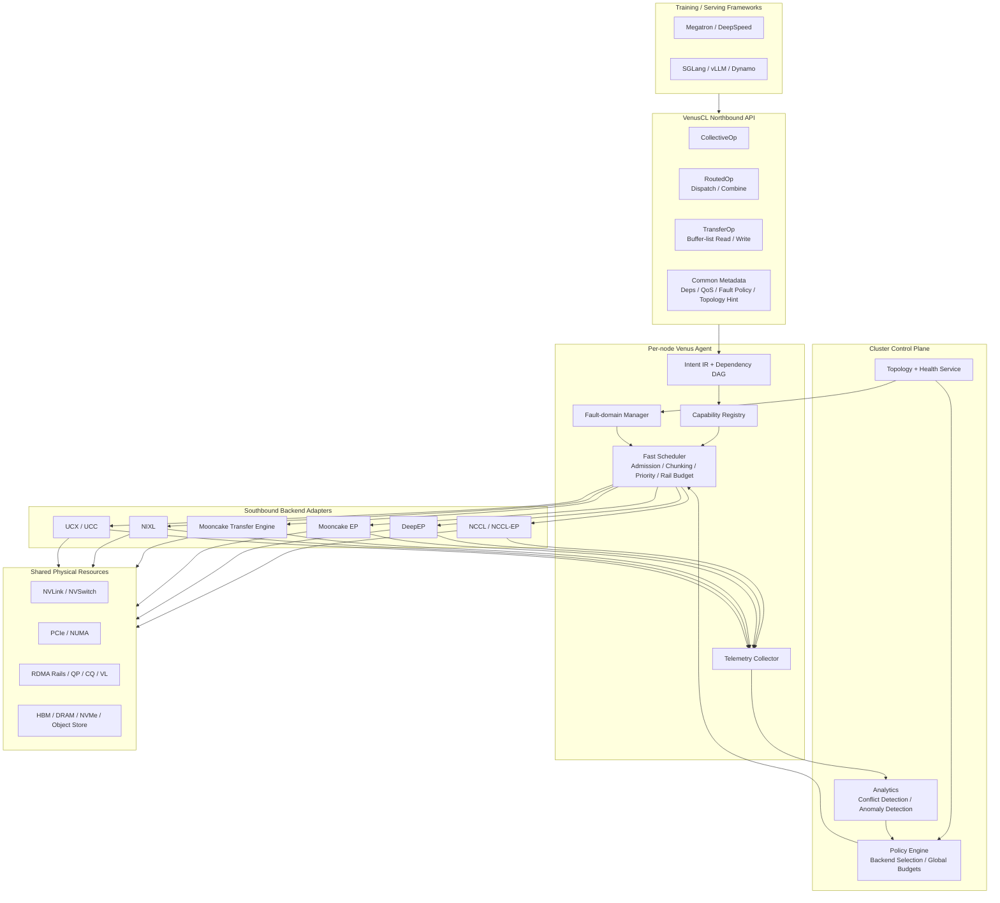

这个修正是对的。更准确的说法不是“VenusCL 只能在 batch 或 staged phase 边界调度”，而是：

**VenusCL 不依赖 packet-level preemption，但它可以把控制点下沉到 operation / batch / staged phase，乃至 verbs 路径上的 WR submission granularity；也就是说，它可以在 `ibv_post_send` 之前或 WR 队列提交边界上做 pause / resume / admission control，只是不假设对已经进入网络、正在飞行中的 packet 做逐包抢占。**

下面给你一版更像 SIGCOMM Introduction/Motivation 的写法，我按这个表述重写了。

---

## Motivation / Introduction Draft

近年来，大模型训练与推理系统中的通信栈正快速从“单一 collective library”走向“多 backend 并存”的格局。除了以 NCCL 为代表的集合通信库之外，训练与 serving 系统已经越来越依赖针对特定流量模式定制的通信后端：例如，MoE 场景下的 DeepEP 区分面向 training/prefill 的 normal kernels 与面向 decode 的 low-latency kernels；Mooncake EP 在与 DeepEP 兼容的接口之上进一步引入 `active_ranks` 等故障语义；Mooncake Transfer Engine 将远程数据移动抽象为 `Segment` 与 `BatchTransfer`；NIXL 则将推理中的异构数据传输组织为 modular plugin backend。与此同时，NCCL 本身也在持续扩展能力边界，文档已覆盖 collectives、point-to-point、device-side communication、`nccl_ep`、profiler plugin、RAS 以及 communicator suspend/resume 等功能。生态演化的结果并不是“所有通信最终收敛为一个统一 kernel”，而是**多个专用数据面长期共存，并共享同一套 NVLink / PCIe / RDMA 物理资源**。([NVIDIA Docs](https://docs.nvidia.com/deeplearning/nccl/user-guide/docs/index.html?utm_source=chatgpt.com))

这一趋势暴露了一个越来越突出的系统性矛盾：**现有通信库的优化与可观测性大多是 library-local 的，但现代 AI workload 的通信冲突与故障传播却是 fabric-wide 的。** 以 MoE 训练和推理为例，Lina 已经指出 all-to-all 与 concurrent allreduce 的带宽竞争会显著拖慢训练，并以优先 all-to-all 的方式进行协调；DeepEP 官方文档也明确建议将 normal kernels、low-latency kernels 与其他 workload 通过 InfiniBand virtual lanes 进行隔离；MoNTA 进一步表明，MoE 性能已经依赖于通信体量与网络拓扑的联合优化。换句话说，今天真正的瓶颈已经不再只是“某个 primitive 是否足够快”，而是**不同 backend 的流量能否在共享 fabric 上被一致地感知、排序与管控**。([USENIX](https://www.usenix.org/system/files/atc23-li-jiamin.pdf?utm_source=chatgpt.com))

遗憾的是，现有方案在这一点上仍然缺少一个统一的薄腰层。单个通信库当然可以各自提供 profiler、health signal 或局部容错机制：例如 NCCL 已经提供 profiler plugin、RAS 与 suspend/resume；Mooncake Transfer Engine 支持异步 transfer 状态管理；Mooncake EP 通过 `active_ranks` 直接暴露 rank activeness。然而，这些信号的语义、粒度与作用域彼此割裂，难以形成跨 backend 的统一视图。Mycroft 的最新工作已经证明，collective communication 一旦作为 black box 存在，就会严重阻碍异常检测与根因分析；但它所解决的仍主要是 collective-library 内部的可观测性问题，而不是 heterogeneous communication libraries 之间的统一关联分析。于是，在现实系统中，一个 rank 的通信变慢，究竟是因为该库自身的异常、其他库引入的流量冲突，还是某个共享 NIC / CQ / rail 出现故障，往往很难被及时且准确地区分。([NVIDIA Docs](https://docs.nvidia.com/deeplearning/nccl/user-guide/docs/index.html?utm_source=chatgpt.com))

这同样带来了新的 fault-handling 问题。现代 AI 系统中的多个通信 backend 通常共享网卡、队列、链路乃至 GPU 侧执行资源，因此故障域本身是跨库的，而恢复逻辑却常常是库内的。Mooncake Transfer Engine 强调多路径和故障转移能力，Mooncake EP 通过 `active_ranks` 让上层能够感知失活 rank，NCCL 也提供了面向运行时诊断与控制的 RAS 和 communicator 管理接口；但如果某个 backend 先感知到故障，而其他 backend 仍持续向同一故障域提交新的通信请求，那么故障很容易从一个本地事件扩散为跨作业、跨库的级联影响。相比“每个库各自恢复”，更关键的问题是：**系统能否在任一 backend 首次观测到异常时，就立刻压缩故障域，冻结共享资源上的后续提交，并协调不同 backend 执行 pause、reroute、shrink 或 resume。**([KVCACHE AI](https://kvcache-ai.github.io/Mooncake/design/transfer-engine/index.html?utm_source=chatgpt.com))

基于上述观察，我们主张 VenusCL 不应被设计为另一个试图吞并所有原语的 monolithic communication library，而应被设计为一个**统一的 communication control layer**。其核心思想是把上层通信请求统一表示为少量 communication intents（例如 collective、routed dispatch/combine、transfer），并附带依赖、优先级、故障策略和拓扑提示等元信息；对下则通过 capability-based adapters 对接 NCCL、DeepEP、Mooncake、NIXL 等现有 backend。这样，VenusCL 不需要重写各个 backend 已经高度优化的数据面 kernel，而是为这些异构 backend 提供统一的 admission control、priority scheduling、telemetry normalization 和 fault-domain management。这个定位与其说是在“替代 NCCL/DeepEP/Mooncake/NIXL”，不如说是在它们之上建立一个面向 AI mixed communication 的控制薄腰。([NVIDIA Docs](https://docs.nvidia.com/deeplearning/nccl/user-guide/docs/index.html?utm_source=chatgpt.com))

在这个 framing 下，VenusCL 的关键挑战不再是“如何发明又一种更快的 primitive”，而是三个系统问题。第一，**如何在不抹平 backend 特性的前提下实现统一抽象**：不同库的 API、进度模型与容错语义差异很大，因而 VenusCL 必须采用 capability-based 而非 lowest-common-denominator 的接口设计。第二，**如何实现真正跨 backend 的流量调度**：VenusCL 不假设对已在飞行中的 packet 做逐包抢占，但它可以利用后端暴露的控制点，在 operation、batch、staged phase 以及更细粒度的 WR submission 边界上，对请求执行 pause / resume / admission control，从而在 latency-sensitive 的 EP 流量与 background transfer 之间建立统一的优先级秩序。第三，**如何做跨 backend 的故障域压缩与统一观测**：VenusCL 需要把来自不同库的事件流映射到共享的资源图和生命周期模型上，才能将“库内异常”提升为“整网因果链条”上的可诊断事件。这个系统视角，正是现有单库优化与 profiling 机制所缺失的。([NVIDIA Docs](https://docs.nvidia.com/deeplearning/nccl/user-guide/docs/index.html?utm_source=chatgpt.com))

因此，本文提出 **VenusCL**：一个面向异构 AI 通信 backend 的统一控制层。VenusCL 将集合通信、MoE routing 与推理数据传输纳入同一套控制平面，以 backend-agnostic 的方式实现统一可观测性、跨库优先级调度以及故障域隔离。我们的目标不是替换现有专用通信库，而是在它们持续演化、长期共存的前提下，为 AI 系统提供一个能够跨 backend 做全局决策的系统基础设施。

---

## 你这点修正后，论文里建议这样写调度粒度

我建议你把相关表述固定成下面这句，比较严谨：

> VenusCL does not require packet-level network preemption. Instead, it exploits backend-exposed control points at the granularity of operations, batches, staged phases, and, when available, work-request submission boundaries (e.g., before `ibv_post_send`) to implement pause, resume, and priority-aware admission control across heterogeneous communication backends.

对应的中文可以写成：

> VenusCL 不依赖对已在网中的 packet 进行逐包抢占，而是利用不同 backend 暴露的控制点，在 operation、batch、staged phase 以及可用时的 work-request 提交边界（如 `ibv_post_send` 之前）实施 pause / resume 与带优先级的 admission control，从而在不侵入底层高性能数据面的前提下实现跨 backend 的统一调度。

如果你愿意，我下一条可以继续把这版再往前推一步，直接补成 **完整的 SIGCOMM Introduction 结构**：`problem → gap → key idea → challenges → contributions` 五段式。

我先给一个判断：你的方向是成立的，但 paper pitch 最好从“再做一个 all-in-one 通信库”改成“做一个统一的 communication control layer / library-of-libraries”。因为 NCCL 本身已经不只是 collective：官方文档现在覆盖 collectives、two-sided/one-sided P2P、device-side communication（LSA/GIN）、`nccl_ep` 的 dispatch/combine、profiler plugin、RAS monitoring，以及 communicator 的 suspend/resume。也就是说，NCCL 已经在向更宽的通信语义扩张。([NVIDIA Docs](https://docs.nvidia.com/deeplearning/nccl/user-guide/docs/index.html))

但另一边，specialized backend 并没有消失，反而在加速出现。DeepEP 明确区分了适合 training/prefill 的 normal kernels 与适合 decode 的 low-latency kernels；Mooncake EP 在 DeepEP-compatible API 上增加了 `active_ranks` 等容错语义；Mooncake Transfer Engine 走的是异步 batch transfer、topology-aware path selection、多 NIC failover；NIXL 则把 inference P2P/data movement 抽象成 plugin-based、memory/storage/backend 统一接口。SGLang 也已经把 PD disaggregation 和 Mooncake 接入作为正式能力文档化。这说明生态不是“最终收敛到一个统一内核”，而是“多个专用数据面长期共存，急需统一控制面”。([GitHub](https://github.com/deepseek-ai/DeepEP/blob/main/README.md))

我建议你把 motivation 收束成下面四点。

1. **问题不是 API 多样性本身，而是 shared fabric 上的跨库失配。**
    
    DeepEP 官方已经建议把 normal kernel、low-latency kernel 和 other workloads 分到不同的 InfiniBand virtual lanes；Lina 则直接把“优先 all-to-all over concurrent allreduce”作为核心优化；Janus 和 MoNTA 进一步把 topology-aware priority / network-traffic-aware optimization 放进系统主设计里。这些工作共同说明，真正难点不是“某个 primitive 不够快”，而是混合通信流量需要跨 backend 的整网 arbitration。([GitHub](https://github.com/deepseek-ai/DeepEP/blob/main/README.md))
    
2. **observability 的缺口在“跨库”，不在“单库”。**
    
    NCCL 已经有 profiler plugin 和 RAS monitoring；Mooncake TE 有 `getTransferStatus`；NIXL 返回 async handle 并做 capability-based backend abstraction。但这些 telemetry surface 天然异构。Mycroft 的价值在于它证明了 coll-level observability 对 collective debugging 很重要，而且“CCLs 作为 black boxes”会让 root-cause analysis 变得困难；不过 Mycroft 聚焦的是 collective communication 本身，而不是 heterogeneous communication libraries 之间的联动。VenusCL 的机会点正是定义一个统一 event schema，让异常检测建立在**整网混合通信**之上，而不是单个库的 completion time。([GitHub](https://github.com/NVIDIA/nccl/tree/master/plugins/profiler))
    
3. **failure handling 的关键是 fault-domain compression，而不是每个库各自恢复。**
    
    Mooncake Transfer Engine 能在 multi-NIC 环境里识别 unavailable connection 并切 alternate path；Mooncake EP 用 `active_ranks` 暴露 broken ranks；NCCL 则有 abort/revoke、RAS、以及 suspend/resume。问题在于，NIC/CQ/rail/GPU 这些是物理共享资源，一个 backend 先发现故障，不代表别的 backend 就不再往同一个故障域发包。VenusCL 最强的系统价值，不是“比某个库恢复更快”，而是**一旦任何 backend 感知故障，就立刻冻结所有共享该资源的提交，把 blast radius 压缩住**，然后再按能力做 reroute / shrink / resume。([KVCACHE AI](https://kvcache-ai.github.io/Mooncake/design/transfer-engine/index.html))
    
4. **不要把 VenusCL 写成“大一统 kernel 库”，要写成“thin waist”。**
    
    UCX 抽象 transport，UCC 抽象 collectives，NIXL 抽象 inference P2P/data movement。VenusCL 最合理的位置，是在它们之上增加一个面向 AI mixed communication 的 control thin waist：统一 intent、capability、telemetry、fault-policy，而把真正的 data plane kernel 留给 NCCL / DeepEP / Mooncake / NIXL 自己继续演进。这样 reviewer 更容易接受，因为你的 novelty 是“跨 backend 的系统控制”，而不是“又一个更大的 kernel 库”。([UCF Consortium](https://ucfconsortium.org/projects/ucc/))

---

## 我建议你在论文里改成的核心 thesis

**VenusCL is not a new monolithic communication kernel library. VenusCL is a unified communication control layer for heterogeneous AI communication backends.**

它把 collectives、MoE dispatch/combine、以及 KV/P2P transfer 看成三类不同的 communication intent；对下通过 capability-based adapters 对接 NCCL / DeepEP / Mooncake / NIXL；对上提供统一的 telemetry、priority scheduling、fault containment 和 backend selection。这样它解决的是**跨 backend 的 contention、observability 和 fault-domain 问题**，而不是试图替代每个 backend 的内核实现。

甚至我会把 **CL** 明确定义成 **Communication Layer**，而不是 **Communication Library**。

---

## 一个可能的 system overall design

这个设计里最关键的不是图本身，而是下面五个点。

**第一，northbound 不要强行统一成一个函数签名，要统一成“intent + metadata”。**

也就是只定义三类 op：`CollectiveOp`、`RoutedOp`、`TransferOp`，再给它们统一补上 `deps / qos / fault_policy / topology_hint / observability_id`。这样不会把 `ncclAllReduce`、`Buffer.dispatch`、`submitTransfer` 硬捏成同一个 API，但它们能进入同一套调度和观测框架。([GitHub](https://github.com/NVIDIA/nccl/blob/master/contrib/nccl_ep/README.md))

**第二，southbound 用 capability-based adapter，而不是 lowest-common-denominator API。**

这点可以直接借鉴 NIXL 的思路：backend 不必“全都会”，而是声明能力位，例如 `supports_collective / supports_dispatch / supports_transfer / supports_pause / supports_reroute / supports_active_ranks / supports_notif / supports_profiler`。调度器根据能力选择 backend 和控制动作。这样 VenusCL 才能兼容接口差异巨大的库。([GitHub](https://github.com/ai-dynamo/nixl/blob/main/docs/BackendGuide.md))

**第三，调度粒度要落在“operation / batch / staged phase”，不要幻想 packet-level preemption。**

NCCL EP 已经支持 staged mode（`send_only` + `ncclEpComplete`）；DeepEP low-latency 有 hook-based overlap；Mooncake TE 以异步 batch transfer 为基本单元。VenusCL 的 fast scheduler 应该利用这些现成的阶段性接口，把高优先级流量插到批次边界或 staged phase 边界，而不是声称能中断任意 in-flight RDMA payload。这样设计更真实，也更容易做出来。([GitHub](https://github.com/NVIDIA/nccl/blob/master/contrib/nccl_ep/README.md))

**第四，统一 telemetry schema 是系统成败的核心。**

我会把每个 op 统一映射成 `submit → admitted → backend_selected → path_selected → started → bytes_progress → completed/failed/rerouted` 这条生命周期。NCCL 侧可接 profiler plugin + RAS；Mooncake TE 侧可接 `getTransferStatus` 和 path/failure 事件；Mooncake EP 侧可接 `active_ranks`；NIXL 侧可接 async handle / notification。这样才能真正做 cross-library contention detection 和 fault correlation。([GitHub](https://github.com/NVIDIA/nccl/tree/master/plugins/profiler))

**第五，fault-domain manager 要维护一张“资源图”，而不是只看 rank。**

图上的节点至少包括：op、communicator/process-group、GPU、CUDA stream、NIC、QP/CQ、rail/VL。任何 backend 上报故障时，先反查受影响资源，再冻结所有共享该资源的后续提交；能 reroute 的就 reroute，能 shrink 的就 shrink，不能的再 abort。这样 VenusCL 的 fault isolation 才是跨 backend 的，而不是把多个单库容错硬拼在一起。这个思路和 Mooncake 的 alternate path、Mooncake EP 的 broken-rank 暴露、NCCL 的 suspend/resume/RAS 是对齐的。([KVCACHE AI](https://kvcache-ai.github.io/Mooncake/design/transfer-engine/index.html))

---

## 这篇 paper 最该强调的不是“峰值带宽”，而是三类 mixed-scenario

如果按 SIGCOMM 写，我会把评估收敛到三个 canonical cases：

1. **decode A2A vs background KV transfer**：证明 VenusCL 能在共享 RDMA fabric 上降低 latency-sensitive EP 的 tail latency。
2. **single NIC/CQ fault under mixed NCCL + Mooncake/NIXL traffic**：证明 VenusCL 能压缩 blast radius。
3. **cross-library slowdown / false positive**：证明 VenusCL 的 unified telemetry 比单库 profiler 更能解释异常。

这样 reviewer 一眼就能看出来：VenusCL 的价值不是把某个 primitive 再快 5%，而是把“异构 AI 通信 backend 共存”这件事第一次做成可调度、可观测、可隔离的系统。

如果你愿意，我下一条可以直接按这个 framing，给你写一版更像 SIGCOMM introduction 的正式 motivation 段落。